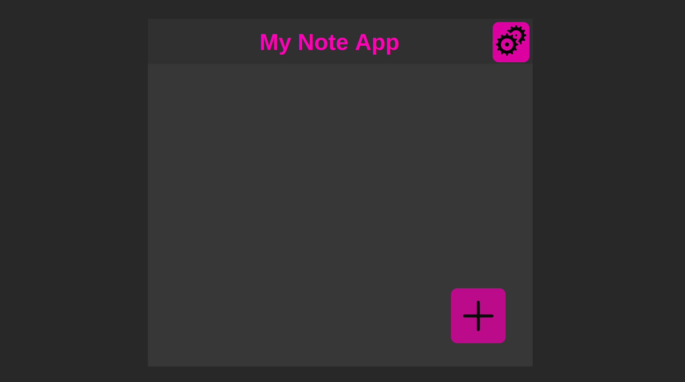

# Notebook app
Easy to use app with adding, deleting, reading and updating functionality.



## Usage
You can add your notes using plus icon. Then it is possible to write some text which will be saved after choosing `back` or `done` button.


If you click the note you are able to update or delete it (it will be deleted after commiting).


If you want to see more text of your notes you can choose `options` sign and check the box.


<p align="center">
↓
</p>

.png)

## Instalation on local machine

```
git init
git clone -b master https://github.com/Krzesimir04/react_note/
cd react_note
npm install
npm start
```

## Additional information
- Notes are saved in local storage
